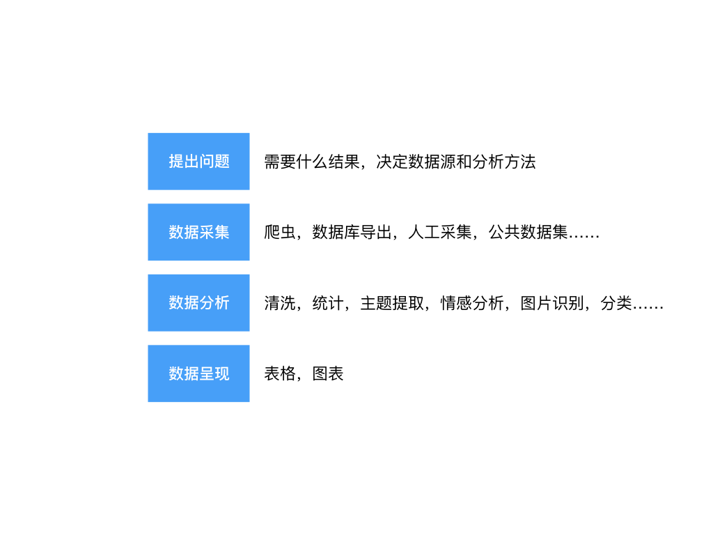
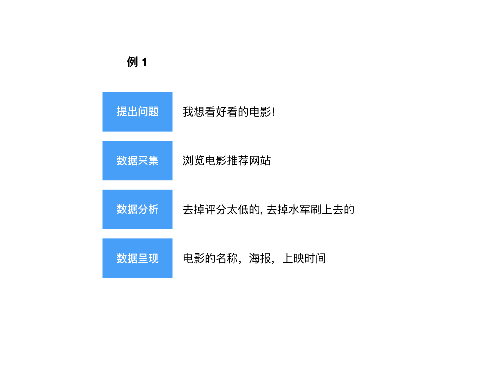
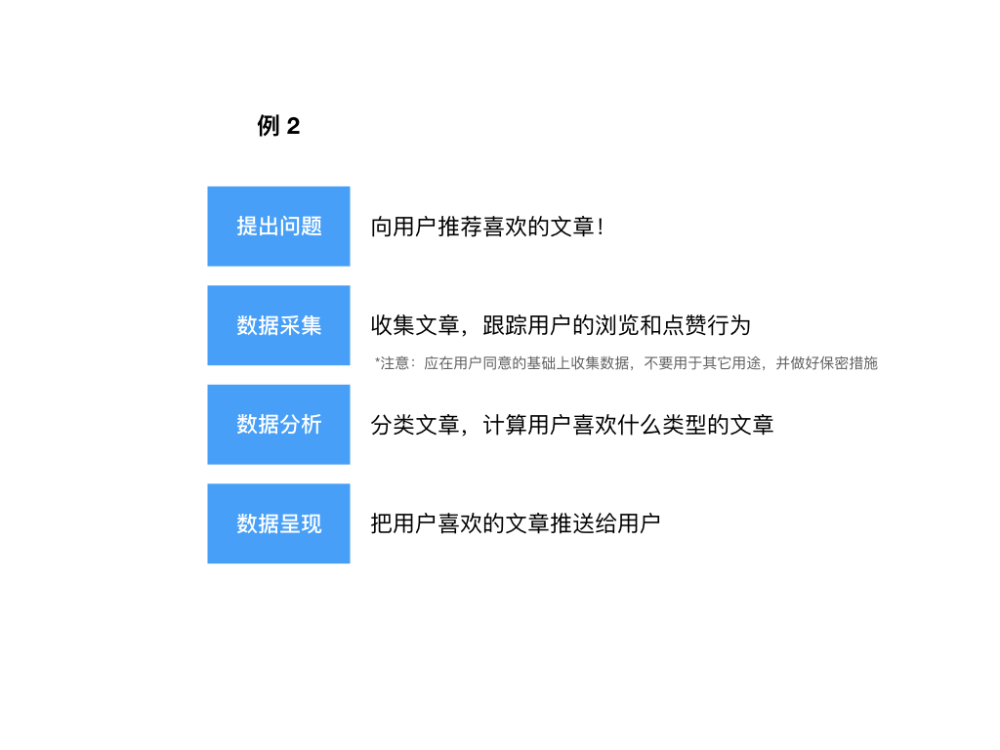

# 什么是数据工程？

数据（資料），Data （Datum 的复数）经常和「信息」「資訊」可以互用。

人类每天都会生产出大量的数据，不仅人类，各种各样的检测仪器都会产生数据。数据可以是数字，文本，图片，图像等各种可以被数字化的信息。

数据工程，就是用工程的手段来处理数据。数据工程基本会涉及下面几个方面：

一个运用数据处理的例子：

上面的例子用到了一个 IT 工具：浏览器。而数据工程师处理的问题经常是这样的：

要处理这个问题，需要掌握更多更强大的工具，并对数据有更深刻的认识。

# 数据工程师的成长路径

- 掌握编程技能（如 Python, R, SAS 等）
- 学习统计学和回归分析（需要一定的概率论和微积分基础）
- 掌握 SQL 查询语言和数据库

## 一些问题

- 我数学不好怎么办？
- 第一，很多分析工具不需要完整的数学知识就能运用。第二，你也可以掌握一些的编程思维，对学习数学会有不少启示。

# 数据工程师的一天

