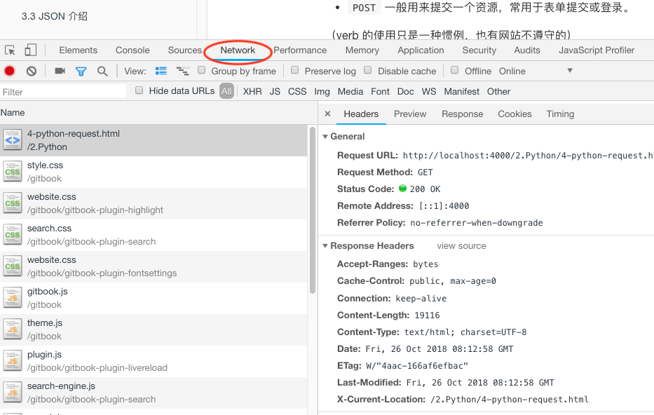

# Python 请求
> Cooking time: 15 mins active / 20 mins passive
>
> **Tasks For Instructors：** 请讲师简单介绍 Python 发请求，HTTP知识。  
> ** 本节稍微了解一下便可 **

## HTTP 简介

HTTP 是超文本传输协议（hypertext transfer protocol）的缩写。

(常见语病：「HTTP 协议」。「P」和「协议」同义重复了，只用「HTTP」即可)

HTTP 规定了客户端和服务器之间传输网页和文件的办法。

客户端：例如浏览器、爬虫、手机应用。
服务器：用网址定位，一般运行于一台电脑上的 80 或者 443 端口。

在 HTTP 语境下，网页或文件一般统称资源（resource)。

HTTP 请求由以下部分组成：

- 请求行，包含请求动作（verb）和请求路径，HTTP 的版本，例如 `GET /images/logo.gif HTTP/1.1`
- 多个请求头，例如告诉服务器我希望获得中文的响应 `accept-language: zh`
- 一个空行
- 可选的消息体 (body)

常用的 HTTP 请求动作（verb）有

- `GET` 一般用来获取一个资源，例如 `GET /images/logo.gif HTTP/1.1`。
- `POST` 一般用来提交一个资源，常用于表单提交或登录。

（verb 的使用只是一种惯例，也有网站不遵守的）

HTTP 响应由以下部分组成：

- 响应行，包含 HTTP 版本和响应代码，例如 `HTTP/2 200`
- 多个响应头，例如告诉客户端消息体的格式 `content-type: image/gif`
- 一个空行
- 可选的消息体

常见的响应代码

- 2XX 正常工作，如 200 OK, 201 Created
- 3XX 重定向，如 302 跳转，304 网页没变化
- 4XX 客户端出问题了，如 400 非法请求，404 资源没找到
- 5XX 服务器出问题了，如 500 服务器内部错误, 504 后台服务超时

## 使用 Chrome 开发者工具查看请求

打开菜单：视图 -> 开发者 -> 开发者工具，选择 "网络" 栏，刷新页面



## Requests 的使用

[Requests](http://docs.python-requests.org/en/master/) 是一个方便的 HTTP 请求库。

```python
import requests
response = requests.get('https://c.xkcd.com/random/comic/')
print(response.text) # 打印网页的 HTML 源代码
```

可以看到以 `<!DOCTYPE html>` 开头的 HTML 内容，下面我们先讲解一下 Python 进阶语法，然后再介绍如何从 HTML 中提取信息。

如果请求的是一张图片，图片文件往往包含大量的非字符数据，需要用 `response.content` 获得内容

```python
response = requests.get('https://ws4.sinaimg.cn/large/006tNbRwly1fwict5oyqdj31kw1kw124.jpg')
with open("crawled_image.jpg", 'rb') as f:
    f.write(response.content)
```

因为写入的是二进制数据，这里的 `open` 使用了 `'rb'` 参数表明用二进制输出流写文件。
