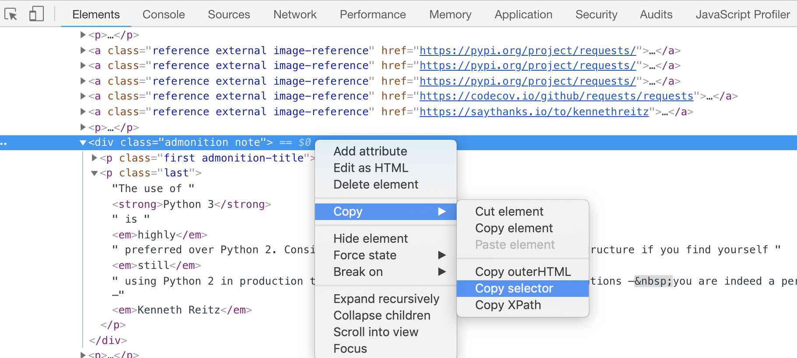

# HTML 与 爬虫

## 为什么学习爬虫要掌握 HTML 基础

HTML 是超文本标记语言（hypertext markup language）的缩写。大部分网页都是以 HTML 写成的。

（常见语病：「HTML 语言」。「L」和「语言」同义重复了，直接说「HTML」即可）

网络爬虫的工作就是代替人去阅读网页，抽取数据。人看到的是渲染好的网页投射进眼睛的影像，而爬虫看到的是 HTML。

注：[MDN](https://developer.mozilla.org/zh-CN/docs/Learn) 是一个比较全面的 Web 初学者的教程，介绍 HTML，CSS 和 JavaScript，上面还有非常全面的 Web 参考。

### HTML 的构造

```html
<!DOCTYPE html>
<header>...</header>
<body>...</body>
</html>
```

常见元素

- 块 `<div>`
- 行内 `<span>`
- 链接 `<a>`，爬虫往往需要特别关注它的 `href` 属性
- 图片 ``
- 视频 `<video>`

常见的属性

- `href` 链接所指向的地址
- `src` 图片的地址
- `id` 用来指定元素唯一的的身份证号码
- `class` 表示元素属于哪些类别，多个类别之间用空格隔开

体验：在 Chrome 浏览器中，右键查看元素。鼠标移到不同的元素上面，观察页面哪一部分高亮了。

# 路径和地址

我们在页面上找到的链接可能是相对路径、绝对路径或者地址。常见的地址格式：

- `http://foo.com/bar` 这是一个 HTTP 地址
- `/some_page?n=3` 这是一个绝对路径，完整的链接需要和它所在页面对应的域名联立起来
- `//foo.com/bar` 这是一个地址，省略的 scheme 和它所在页面相同，可以补足为 `http://foo.com/bar` 或者 `https://foo.com/bar`

### CSS 选择器

CSS 是层叠样式表 (Cascade Stylesheet) 的缩写。

（常见语病：「CSS 样式表」。「S」和「样式表」同义重复了，直接说「CSS」即可）

在 CSS 中，选择器（selector）可以用于定位我们想要样式化的 HTML 元素。虽然我们这里不需要给 HTML 元素指定外观和样式，但选择器可以帮助我们选取需要的元素。

- 元素选择器 `div`，`span`，`a`
- id 选择器
- class 选择器

例：假设有以下的 HTML 页面

```html
<p id="question">What color do you like?</p>
<div>I like blue.</div>
<p class="paragraph red">I prefer red!</p>
```

- 用 `#question` 选择器可以获得 `<p id="question">What color do you like?</p>`
- 用 `div` 选择器可以获得 `<div>I like blue.</div>`
- 用 `.red` 选择器可以获得 `<p class="paragraph red">I prefer red!</p>`

组合选择器

`div .red a` 匹配 `<div>` 元素里面的 `red` 类任意元素里面的 `<a>` 元素

## 快速获取选择器

打开网页，使用 Chrome 开发者工具，选择对应的元素，右键复制选择器



## 用 Python 解析 HTML

[Beautiful Soup](https://www.crummy.com/software/BeautifulSoup/bs4/doc.zh/) 是一个可以从 HTML 中提取数据的 Python 库。

假设我们获取了下面的页面并赋值给了变量 `page`（回忆 Python 的多行字符串语法）

```python
page = """
<p id="question">What color do you like?</p>
<a href="/blue">I like blue.</a>
<p class="paragraph red">I prefer red!</p>
"""
```

假设我们要获取 `id` 为 `question` 的元素的内容，以及链接的地址 `/blue`，使用 Beautiful Soup 可以这样解析：

```python
from bs4 import BeautifulSoup
soup = BeautifulSoup(page) # 创建一个 soup 对象

matched_elements = soup.select('#question')
links = soup.select('a')
```

`select` 函数返回的结果是列表, 回忆之前学的列表，我们可以用下标访问：

```python
question = matched_elements[0].text # element.text 是
print(question)
```

也可以遍历它：

```python
for a in links:
    print(a['href'])
```
