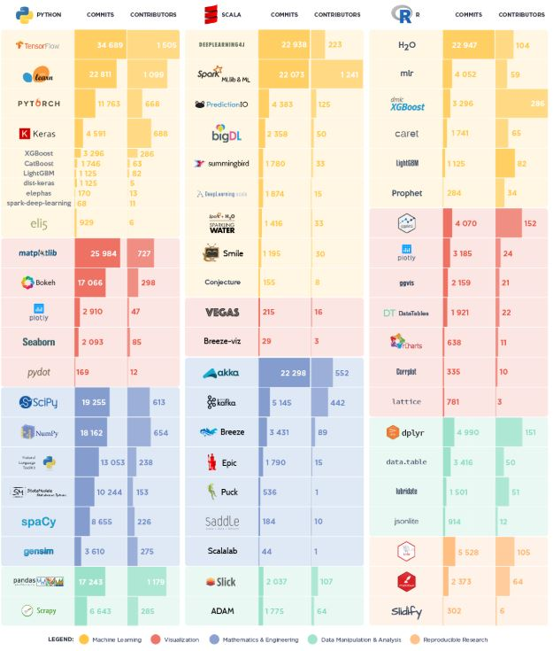

## 算法实现的常用编程语言以及优缺点

常用算法实现语言有Python, Scala和R三种。

Python是一门通用脚本语言，在最近几年发展迅速，有活跃的开源社区不断贡献越来越多的机器学习和深度学习算法包。由于建模简单，同时对工程化有很好的支持，所以同时受到数据科学家和软件工程师的喜爱。

R是一门为经典统计学设计的脚本语言，有最全和最成熟的开源机器学习算法包。但是R偏向于快速建模和极简语法，很多情况下并不适合工程化。

Scala是一门专门为大数据而设计的新兴静态语言，也是大数据计算模块Spark的原生语言，非常适合大数据类应用的工程化，但针对机器学习算法和可视化的开源库并不成熟。

三种常用语言的算法包以及活跃程度：可以见到Python不论在算法还是工程化都拥有相对较高的活跃度：

[源数据](https://activewizards.com/blog/comparison-of-top-data-science-libraries-for-python,-r-and-scala-infographic/)