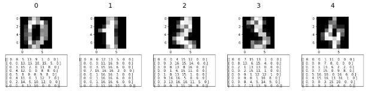
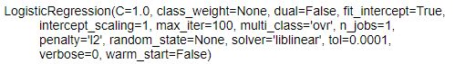
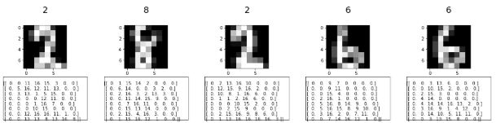
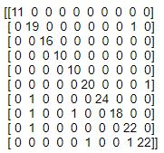
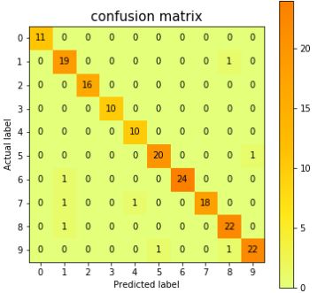
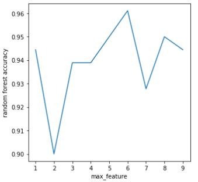

## 分类算法开发过程

### 数据读取

案例使用sklearn库自带的数字库：

```python
from sklearn.datasets import load_digits
digits = load_digits()
print("数据行数，列数：" , digits.data.shape)
print("标签行数，列数：", digits.target.shape)
```

数据行数，列数： (1797, 64)

标签行数，列数： (1797,)

### 显示示例图片

```python
import numpy as np 
import matplotlib.pyplot as plt
fig, ax = plt.subplots(2,5,figsize=(20,4))
for index, (image, label) in enumerate(zip(digits.data[0:5], digits.target[0:5])):
    ax[0,index].imshow(np.reshape(image, (8,8)), cmap='gray')
    ax[0,index].set_title('%i\n' % label, fontsize = 20)
    ax[1,index].text(0,0,np.reshape(image, (8,8)))
    ax[1,index].set_xticks([])
    ax[1,index].set_yticks([])
```


### 创建训练集和测试集

```python
from sklearn.model_selection import train_test_split
x_train, x_test, y_train, y_test = train_test_split(
	digits.data, digits.target, test_size=0.1, random_state=0)
print('训练集数量：{0}，测试集数量：{1}'.format(x_train.shape[0],x_test.shape[0]))
```
训练集数量：1617，测试集数量：180

### scikit-learn四步建模

**第1步：** 引用算法包（案例为分类问题，以逻辑回归为例）：

```python
from sklearn.linear_model import LogisticRegression
```

**第2步：** 生成模型实例，模型命名为logisticRegr:

```python
logisticRegr = LogisticRegression()
```

**第3步：** 训练模型，输入为训练集数据和标签x_train, y_train，输出为模型参数：

```python
logisticRegr.fit(x_train, y_train)
```


**第4步：** 预测新样本的标签，输入为测试集，输出为一列标签数组：

```python
predictions = logisticRegr.predict(x_test)
```

打印前5个预测结果：

```python
fig, ax = plt.subplots(2,5,figsize=(20,4))
for index, (image, label) in enumerate(zip(x_test[0:5], predictions[0:5])):
    ax[0,index].imshow(np.reshape(image, (8,8)), cmap='gray')
    ax[0,index].set_title('%i\n' % label, fontsize = 20)
    ax[1,index].text(0,0,np.reshape(image, (8,8)))
    ax[1,index].set_xticks([])
    ax[1,index].set_yticks([])
```


### 衡量模型性能

最简单的分类问题模型衡量标准是准确率（accuracy）= 正确预测的图像数 / 所有测试图像数

```python
score = logisticRegr.score(x_test, y_test)
print('逻辑回归准确率为 {0:.2%}'.format(score))
```
逻辑回归准确率为 95.56%

另外一种更严谨的分类模型衡量标准是混淆矩阵（confusion matrix）。

混淆矩阵也称误差矩阵，是表示精度评价的一种标准格式，用n行n列的矩阵形式来表示。在人工智能中，混淆矩阵（confusion matrix）是可视化工具，特别用于监督学习。混淆矩阵的每一列代表了预测类别 ，每一列的总数表示预测为该类别的数据的数目；每一行代表了数据的真实归属类别，每一行的数据总数表示该类别的数据实例的数目。每一列中的数值表示真实数据被预测为该类的数目。处于对角线上的数字指正确预测的数目；所有不在对角线上的数字都是错误预测的数目。

由混淆矩阵可以得出不同于准确率（accuracy）的其他衡量标准，比如精度（precision）和召回率（recall）。在数据集不平衡的情况下，这两个衡量标准比准确率更能体现模型性能。

引用metrics包，计算混淆矩阵：输入为测试集实际标签y_test和预测标签predictions：

```python
from sklearn import metrics
cm = metrics.confusion_matrix(y_test, predictions)
print(cm)
```


也可以用热力图形式表现（matplotlib颜色选择在[这里](https://matplotlib.org/examples/color/colormaps_reference.html)）：

```python
plt.figure(figsize=(6,6))
plt.imshow(cm, cmap='Wistia')
plt.title('confusion matrix', size = 15)
plt.colorbar()
tick_marks = np.arange(10)
plt.xticks(tick_marks, ["0", "1", "2", "3", "4", "5", "6", "7", "8", "9"], size = 10)
plt.yticks(tick_marks, ["0", "1", "2", "3", "4", "5", "6", "7", "8", "9"], size = 10)
plt.grid(False)
plt.ylabel('Actual label', size = 10)
plt.xlabel('Predicted label', size = 10)
width, height = cm.shape

for x in np.arange(width):
    for y in np.arange(height):
        plt.annotate(str(cm[x][y]), xy=(y,x), 
                    horizontalalignment='center',
                    verticalalignment='center')
```


### 其他sklearn分类模型

随机森林分类器：

```python
from sklearn.ensemble import RandomForestClassifier
randomForest = RandomForestClassifier(random_state=4711)
randomForest.fit(x_train, y_train)
score_rfc = randomForest.score(x_test, y_test)
print('随机森林准确率为 {0:.2%}'.format(score_rfc))
```
随机森林准确率为 95.00%

支持向量机分类器：

```python
from sklearn.svm import SVC
svc = SVC(kernel="linear")
svc.fit(x_train, y_train)
score_svc = svc.score(x_test, y_test)
print('线性支持向量机准确率为 {0:.2%}'.format(score_svc))
```
线性支持向量机准确率为 97.78%

KNN最近邻分类器：

```python
from sklearn.neighbors import KNeighborsClassifier
kn = KNeighborsClassifier(10)
kn.fit(x_train, y_train)
score_kn = kn.score(x_test, y_test)
print('最近邻准确率为 {0:.2%}'.format(score_kn))
```
最近邻准确率为 96.67%

[简单神经网络分类器](http://scikit-learn.org/stable/modules/neural_networks_supervised.html)：

```python
from sklearn.neural_network import MLPClassifier
nn = MLPClassifier()
nn.fit(x_train, y_train)
score_nn = nn.score(x_test, y_test)
print('神经网络准确率为 {0:.2%}'.format(score_nn))
```
神经网络准确率为 96.11%

朴素贝叶斯分类器：

```python
from sklearn.naive_bayes import GaussianNB
nb = GaussianNB()
nb.fit(x_train, y_train)
score_nb = nb.score(x_test, y_test)
print('朴素贝叶斯准确率为 {0:.2%}'.format(score_nb))
```
朴素贝叶斯准确率为 85.00%

### 调参的重要性

以前例中的随机森林模型为例：调整模型的max_features参数，定义节点分枝时使用的特征数量，平衡variance和bias：

将max_features设置为范围1-9：

```python
list_max_features = np.arange(1,10,1)

list_scores = list()
for nrFeatures in list_max_features:
    randomForest = RandomForestClassifier(max_features=nrFeatures,random_state=4711)
    randomForest.fit(x_train, y_train)
    score_rfc = randomForest.score(x_test, y_test)
    list_scores += [score_rfc]
    
plt.figure(figsize=(5,5))
plt.plot(list_max_features,list_scores)
plt.ylabel('random forest accuracy')
plt.xlabel('max_feature')
```



### 数据预处理的重要性

预处理方法1：[标准化数据处理](http://scikit-learn.org/stable/auto_examples/preprocessing/plot_scaling_importance.html#sphx-glr-auto-examples-preprocessing-plot-scaling-importance-py)：调整特征数据范围和方差，使所有特征的平均值为0，方差为1。避免由于特征范围和变化幅度不同对模型结果产生影响。

```python
from sklearn.preprocessing import StandardScaler
scaler = StandardScaler()
scaler.fit(x_train)
x_train_scaled = scaler.transform(x_train)
x_test_scaled = scaler.transform(x_test)
```

预处理方法2：[主成分分析](http://scikit-learn.org/stable/modules/generated/sklearn.decomposition.PCA.html)，转化特征为线性不相关，并实现降维：

```python
from sklearn.decomposition import PCA
pca = PCA(.99)
pca.fit(x_train_scaled)
x_train_decomposed = pca.transform(x_train_scaled)
x_test_decomposed = pca.transform(x_test_scaled)
```

再用相同的朴素贝叶斯分类模型进行训练和预测，得到更高准确率：

```python
nb_decomposed = GaussianNB()
nb_decomposed.fit(x_train_decomposed, y_train)
score_nb_decomposed = nb_decomposed.score(x_test_decomposed, y_test)
print('朴素贝叶斯准确率为 {0:.2%}'.format(score_nb_decomposed))
```
朴素贝叶斯准确率为 95.00%


内容参考：

[python tutorial](https://github.com/mGalarnyk/Python_Tutorials/blob/master/Sklearn/Logistic_Regression/LogisticRegression_toy_digits_Codementor.ipynb)

[sklearn classifiers](http://scikit-learn.org/stable/auto_examples/classification/plot_classifier_comparison.html)


