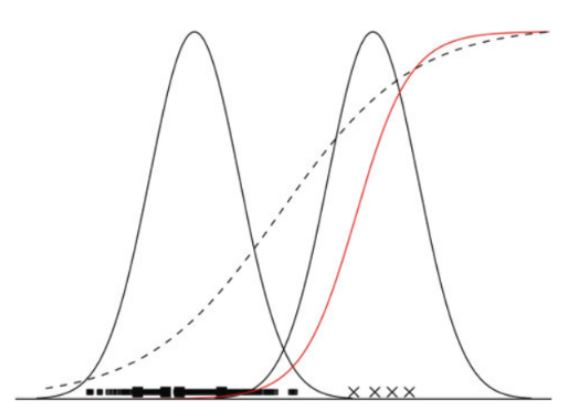

## 特征工程简介


[来源](https://blog.csdn.net/u010089444/article/details/70053104)

我们常说的特征工程是这个图里的特征处理部分。下面基于sklearn的特征处理库以及鸢尾花数据集分步说明一下。

```python
import pandas as pd
import seaborn as sns
import matplotlib.pyplot as plt

from sklearn.datasets import load_iris

iris = load_iris()
irisData = pd.concat([pd.DataFrame(iris.data, columns=iris.feature_names), 
                      pd.DataFrame(iris.target,columns=['species'])],axis=1)
```

### 特征处理 · 特征清洗 · 清洗异常样本

最常见的发现异常样本的方式都是目检，比如用box-plot/直方图/散点图显示不同维度间的关系，从而找到离群点。

```python
sns.boxplot(x="species", y="petal length (cm)", data=irisData)
plt.show()
```


```python
sns.pairplot(irisData, hue="species", vars=irisData.columns.tolist()[0:4])
```


还可以用高斯分布定义N个sigma以外的数据点都是异常点：

```python
sepalwid = irisData.loc[irisData.species==0, "sepal width (cm)"]
sns.distplot(sepalwid)
```


```python
threshold_pos = np.mean(sepalwid) + 4 * np.var(sepalwid)
threshold_neg = np.mean(sepalwid) - 4 * np.var(sepalwid)
outlier = irisData.loc[(irisData.species==0) & (
        (irisData["sepal width (cm)"]>threshold_pos) | 
        (irisData["sepal width (cm)"]<threshold_neg) ), :]
```
|sepal length (cm)|sepal width (cm)|petal length (cm)|petal width (cm)|species
-|----------------|----------------|-----------------|----------------|-------
14|5.8|4|1.2|0.2|0
15|5.7|4.4|1.5|0.4|0
32|5.2|4.1|1.5|0.1|0
33|5.5|4.2|1.4|0.2|0
41|4.5|2.3|1.3|0.3|0

另外还可以使用基于距离的算法，比如：

k-means:

```python
from sklearn.cluster import KMeans
from mpl_toolkits.mplot3d import Axes3D
import numpy as np

km = KMeans(n_clusters=3)
km.fit(irisData.drop("species",axis=1))
km.predict(irisData.drop("species",axis=1))
labels = km.labels_

fig = plt.figure(1, figsize=(7,7))
ax = Axes3D(fig, rect=[0, 0, 0.95, 1], elev=48, azim=134)
ax.scatter(irisData.iloc[:, 3], irisData.iloc[:, 0], irisData.iloc[:, 2],
          c=labels.astype(np.float), edgecolor="k", s=50)
ax.set_xlabel("Petal width")
ax.set_ylabel("Sepal length")
ax.set_zlabel("Petal length")
plt.title("K Means", fontsize=14)
```


```python
def calDistance(dataRow, centers):
    data = np.array(dataRow[0:4])
    target = int(list(dataRow)[-1])
    center = centers[target]
    return np.sqrt(np.sum((data-center) * (data-center)))

centers = km.cluster_centers_
irisData['distance'] = irisData.apply(lambda row: 
						calDistance(row, centers), axis=1)
irisData = irisData.sort_values('distance',ascending=False)
irisData.iloc[0:5,:]
```
|sepal length (cm)|sepal width (cm)|petal length (cm)|petal width (cm)|species|distance
-|----------------|----------------|-----------------|----------------|-------|--------
77|6.7|3|5|1.7|1|4.203283
52|6.9|3.1|4.9|1.5|1|4.131827
83|6|2.7|5.1|1.6|1|4.069741
76|6.8|2.8|4.8|1.4|1|4.008191
72|6.3|2.5|4.9|1.5|1|3.98758

还有sklearn上的各种[离群点检测](http://scikit-learn.org/stable/modules/outlier_detection.html)方法和[对比](http://scikit-learn.org/stable/auto_examples/plot_anomaly_comparison.html#sphx-glr-auto-examples-plot-anomaly-comparison-py):


|one class SVM|robust covariance|isolation forest|local outlier factor
-|-------------|-----------------|----------------|------------------
数据分布前提|有|有|无|无
多类别离群点检测性能|低|低|高|高
不同密度多类别离群点检测性能|低|低|低|高
高维度数据离群点检测性能|低|低|高|低
泛化能力|低|高|高|高

### 特征处理 · 特征清洗 · 采样 · 数据不均衡

样本不均衡指的是数据集中的正样本数量与负样本数量的比例失衡。例如，实际应用中，负样本的数量通常远远大于正样本。

样本不均衡的危害：造成分类器在多数类精度较高，少数类的分类精度很低，甚至造成分类器失效。

有些分类器非常不利于处理不均衡样本，比如逻辑回归。有些分类器对于不均衡样本的敏感度相对较低，比如各种树形结构。

以二分类的逻辑回归模型为例说明不均衡样本的影响：



[来源](https://medium.com/bluekiri/dealing-with-highly-imbalanced-classes-7e36330250bc)

上图中的两个正态分布曲线代表两个类别A和B的样本取值概率密度，底部的实心点代表大类别A的样本点，X点代表小类别B的样本点。

当两个类别的样本点平衡时，B类别的S函数在虚线的位置（sigmoid函数的横轴为样本点取值范围，纵轴为样本点被分为B类的概率）。当样本点不平衡时，分类器的S函数在实红线位置。

可以看到红线在很大取值范围内都处于虚线下方。换句话说当数据不平衡时，B类的很大一部分数据点都会被错误归类为A类。

解决方案分为以下几种：

- 欠采样：通过减少多数类样本来提高少数类的分类性能 
随机地去掉一些多数类样本来减小多数类的规模，该方法的缺点是会丢失多数类的一些重要信息，不能够充分利用已有的信息
通过一定规则有选择的去掉对分类作用不大的多数样本（保留与正样本较为接近的负样本）
- 过采样：通过改变训练数据的分布来消除或减小数据的不平衡 
对少数类样本进行复制，该方法的缺点是可能导致过拟合，因为没有给少数类增加任何新的信息

或者在算法层面改进损失函数的权重，加大少数样本的权值。

或者采用对样本分布敏感度相对较低的算法类型，比如决策树或集成学习。

关于欠采样的大类别采样个数选择：

首先构建新的目标函数用来衡量模型好坏。一种考虑不平衡数据集的目标函数是[归一化交叉熵](http://quinonero.net/Publications/predicting-clicks-facebook.pdf):

`Normalized CrossEntropy [...] is the predictive
log loss normalized by the entropy of the [...] average empirical CTR of the training data set.`

$$ NE = \cfrac{-\frac{1}{N}\sum_{i=1}^n \big{(} \frac{1+y_i}{2}log(p_i)+\frac{1-y_i}{2}log(1-p_i) \big{)}}{-(p*log(p) + (1-p)*log(1-p))} $$，其中$$y_i \in \{-1,1\}$$是样本点i的标签。

然后采样不同比例的大类别样本点，可以得到欠采样个数与目标函数的关系曲线。归一化交叉熵的数值越小，说明分类的性能越好：


[来源](https://medium.com/bluekiri/dealing-with-highly-imbalanced-classes-7e36330250bc)

### 特征处理 · 预处理 · 单个特征 · 归一化

为什么要做归一化：我们在对数据进行分析的时候，往往会遇到单个数据的各个维度量纲不同的情况，比如对房子进行价格预测的线性回归问题中，房子的特征包括面积（平方米）、房间数（个）两个维度，采用梯度下降进行训练的过程如下图所示：


[来源](https://blog.csdn.net/u010089444/article/details/70053104)

算法在寻找最优值的时候，由于图像“细长”，所以要来回找垂直线，两个特征的取值区间相差越大，图像就越“细长”，梯度下降就越慢，还可能永远无法收敛。因此需要使用归一化的方法将特征的取值区间缩放到某个特定的范围，例如[0, 1]等：

**区间缩放（Min-Max scaling）**

区间缩放法将原始数据中特征的取值区间转换到[0 1]范围，归一化公式如下：

$$ x_{norm} = \cfrac{x-x_{min}}{x_{max}-x_{min}} $$

该方法实现对原始数据的等比例缩放，其中x为原始数据，$$x_{norm}$$为归一化后的数据，$$x_{max}$$和$$x_{min}$$分别为原始数据的最大值和最小值。使用preproccessing库的MinMaxScaler类对数据进行区间缩放的代码如下：

```python
from sklearn.preprocessing import MinMaxScaler
MinMaxScaler().fit_transform(iris.data)
```

**标准化（standardization）**

该方法将原始数据归一化成均值为0、方差1的数据，归一化公式如下：

$$x_{norm} = \cfrac{x-\mu}{\sigma}$$

其中$$\mu$$和$$\sigma$$分别为原始数据的均值和方法。该种归一化方式要求原始数据的分布可以近似为高斯分布，否则归一化的效果会变得很糟糕。使用preproccessing库的StandardScaler类对数据进行标准化的代码如下：

```python
from sklearn.preprocessing import StandardScaler
StandardScaler().fit_transform(iris.data)
```

**归一化（normalization）**

标准化是依照特征矩阵的列处理数据，将样本的特征值转换到同一量纲下。除此之外，我们还可以对每个样本（特征矩阵中的行）进行归一化，将样本所对应的特征向量转化为单位向量，其目的在于样本向量在点乘运算或其他核函数计算相似性时，拥有统一的标准。使用preproccessing库的Normalizer类对数据进行归一化的代码如下：

```python
from sklearn.preprocessing import Normalizer
Normalizer().fit_transform(iris.data)
```

### 特征处理 · 预处理 · 单个特征 · 离散化

**特征二值化**

特征二值化的方法是将特征的取值转化为0或1。例如，在房价预测问题中对于“是否为学区房”这一特征，取值为1表示该房是学区房，反之则为0。

在sklearn中可以设置一个阈值，大于阈值的赋值为1，小于等于阈值的赋值为0。使用preproccessing库的Binarizer类对数据进行二值化的代码如下：

```python
from sklearn.preprocessing import Binarizer
Binarizer(threshold=3).fit_transform(iris.data)
```

**dummy coding 哑编码**

又叫one-hot编码。例如，性别：｛男，女｝，可以采用one-hot编码的方式将特征表示为一个m维向量，其中m为特征的取值个数。在one-hot向量中只有一个维度的值为1，其余为0。以“性别”这个特征为例，我们可以用向量 “1，0”表示“男”，向量 “0，1”表示“女”。使用one-hot编码可将离散特征的取值扩展到了欧式空间，便于进行相似度计算。使用preproccessing库的OneHotEncoder类对数据进行one-hot编码的代码如下：

```python
from sklearn.preprocessing import OneHotEncoder
OneHotEncoder().fit_transform(iris.target.reshape((-1,1)))
```

### 特征处理 · 预处理 · 单个特征 · 缺失值

1. 删除缺失值：可能导致信息丢失
2. 用平均数 mean、中位数 median、众数 most frequent 填补缺失值。
3. 基于与其他特征和数据的相关性，建立线性或非线性拟合模型学习数据pattern，预测缺失值。

```python
from sklearn.preprocessing import Imputer
data = np.vstack((iris.data, [[None, None, None, None]]))
imputStrategy = ['mean','median','most_frequent']
for strat in imputStrategy:
    print('{}:{}'.format(strat,
          Imputer(strategy=strat).fit_transform(data)[-1,:]))
```

### 特征处理 · 预处理 · 单个特征 · 数据变换

数据转换通常是为了使数据的分布满足模型假设。比如当时间序列不稳定时（e.g.随自变量增加，因变量方差也增加），或当研究对象不是因变量，而是因变量增长率时（转换后相关性变为线性关系）。

数据转换后通常样本分布会由偏态分布近似变为正态分布，方便应用各种以正态分布为前提的统计工具。

处理偏态分布中的指数分布数据的最常见方法是对数变换(log transformation)。

```python
from numpy import log1p
from sklearn.preprocessing import FunctionTransformer
FunctionTransformer(log1p).fit_transform(iris.data)
```

对于离散计数数据，通常[不建议使用对数变换](https://besjournals.onlinelibrary.wiley.com/doi/full/10.1111/j.2041-210X.2010.00021.x)，因为对数变换不能处理样本有0值的情况。

另外一种常见的数据转换方式是使用[box-cox转换](https://www.statisticshowto.datasciencecentral.com/box-cox-transformation/)。

$$ y(\lambda) =  
  \begin{cases}
    \cfrac{y^{\lambda}-1}{\lambda} &\quad \text{if } \lambda \neq 0 \\ 
    \text{log }y &\quad \text{if } \lambda = 0
  \end{cases}$$

scipy.stats库里有三个boxcox转换相关的函数：

- `boxcox_normmax`函数自动计算boxcox最佳$$\lambda$$值，如果不用这个，也可以自己找最优值。
- `boxcox_normplot`函数是scipy已经封装好了的grid search，函数输入值是（数据，实验$$\lambda$$值下限，实验$$\lambda$$值上限, etc.), 返回的是所有搜索过的参数和结果。选择ppcc最大值对应的$$\lambda$$值就是分布最接近正态的转换。
- `boxcox`函数可以给定$$\lambda$$值，计算转换结果。不给定$$\lambda$$会直接返回最优的转化结果。

```python
from scipy.stats import boxcox, boxcox_normplot, boxcox_normmax

def compare(original, converted,titles):
    fig,ax = plt.subplots(1,2,sharey=True)
    ax[0].set_title('original')
    sns.distplot(original, hist=True, ax=ax[0])
    for i in np.arange(len(converted)):
        sns.distplot(converted[i], hist=False, ax=ax[1],label=titles[i])
    ax[1].legend(loc="upper right")
    ax[1].set_title('boxcox transformed')
    fig.show()

original = np.array([1,1,1,2,2,2,2,3,3,3,3,3,4,4,4,4,4,4,5,5,5,5,5,5,5,5,5,
                     6,6,6,6,6,6,6,6,6,6,6,7,7,7,7,7,7,7,7,7,7,8,8,8,8,8,8,
                     8,8,8,8,8,8,8,8,9,9,9,9,9,9,9,9,9,9,9,9,9,9,9,9,9,9,9,
                     9,10,10,10,10,10,10,10,10,10,10,10,10,10,10,10,10,10,
                     10,10,10,10,10,10,10,10,10,10,10,10,10,10,10,10,10,10,
                     10,10,10,10,10,10,10,10,10,10,10,10,10,10,10,10,10,10])

lmbda1 = boxcox_normmax(original)

lmbdas, ppcc = boxcox_normplot(original, la=-5, lb=5)
k = np.argmax(ppcc)
lmbda2 = lmbdas[k]

converted1 = boxcox(original, lmbda=lmbda1)
converted2 = boxcox(original, lmbda=lmbda2)
converted3,_ = boxcox(original)

if lmbda1 < 0.01 and -0.01 < lmbda1:
    converted4 = np.log(original)
else:
    converted4 = ((original)**lmbda1 - 1) / lmbda1

compare(original, [converted1,converted2,converted3,converted4],
        ['normmax lmbda1='+str(round(lmbda1,2)),
         'normplot lmbda2='+str(round(lmbda2,2)),
         'auto','manual lmbda1'])
```


### 特征处理 · 预处理 · 多个特征 · 特征选择

数据预处理完成后，接下来需要从给定的特征集合中筛选出对当前学习任务有用的特征，这个过程称为特征选择（feature selection）。通常来说，从两个方面来选择特征：

- 特征是否发散：如果一个特征不发散，例如方差接近于0，也就是说样本在这个特征上基本上没有差异，这个特征对于样本的区分并没有什么用。
- 特征与目标的相关性：这点比较显见，与目标相关性高的特征，应当优先选择。

为什么要做特征选择？

**bias-variance tradeoff 偏差-方差均衡**

偏差是模型平均预测值和实际值之差。一个有很高偏差的模型并没有从训练集中学习到数据模式，通常是因为模型相对于实际数据过于简化了。

方差是模型预测对于样本值变化的敏感程度。一个有很高方差的模型能够精确拟合训练集，但对新的样本点预测准确度变差（过拟合）。造成过拟合的原因通常是模型抽象出了太多训练集里可能并不存在的数据模式，造成模型泛化能力弱。偏差-方差均衡示例如下：


[来源](https://towardsdatascience.com/understanding-the-bias-variance-tradeoff-165e6942b229)

设变量关系为：$$ Y=f(X) + \epsilon $$，$$\epsilon$$为随机error（平均值为0的正态分布）。设预测模型为$$\hat{f}(X)$$。在样本点x处有：

$$Err(x)=E[(Y-\hat{f}(x))^2]$$，并可以分解为：

$$Err(x)=\big( E[\hat{f}(x)]-f(x) \big)^2 + E\big[ (\hat{f}(x)-E[\hat{f}(x)])^2 \big] + \sigma_{e}^2$$，或写成：

$$Err(x)=\text{Bias}^2+\text{Variance}+\text{Irreducible Error}$$

模型的复杂程度通常理解是与特征的个数有关的。特征的个数越多，模型越复杂，就越有可能过拟合。

为了能够在偏差和方差之间平衡，使total error最小，需要对特征进行选择：


[来源](https://towardsdatascience.com/understanding-the-bias-variance-tradeoff-165e6942b229)

常见的特征选择方法可分为三类：过滤法（Filter）、包裹法（Wrapper）、嵌入法（Embedding）

- 过滤法：按照发散性或者相关性对各个特征进行评分，设定阈值或者待选择阈值的个数，选择特征。
- 包裹法：包裹式特征选择直接把最终要使用的学习器性能作为特征子集的评价标准。
- 嵌入法：将特征选择过程和机器训练过程融合为一体。两者在同一优化过程中完成，即在学习器训练过程中自动进行了特征选择。

### 特征处理 · 预处理 · 多个特征 · 特征选择 · 过滤法

**方差过滤法**

方差过滤法需要计算每个特征的方差，然后根据阈值删除取值小于阈值的特征。例如，假设某特征的取值为0和1，且训练集中有90%以上的数据在该特征的取值为1，那么可认为该特征对于区分不同数据的作用不大。

方差过滤法只能用于筛选离散的特征，如果特征的取值是连续的，就需要将连续值离散化之后才能用。另外如果只使用方差过滤法，而不检查过滤排除的特征与因变量的相关性，有可能造成重要信息的损失。

使用feature_selection库的VarianceThreshold类来选择特征的代码如下：

```python
from sklearn.feature_selection import VarianceThreshold
VarianceThreshold().fit_transform(iris.data)
```

**pearson相关系数**

皮尔森相关系数（Pearson Correlation）是一种最简单的，能帮助理解特征和目标变量之间关系的方法，该方法衡量的是变量之间的**线性相关性**，结果的取值区间为[-1，1]，-1表示完全的负相关(这个变量下降，那个就会上升)，+1表示完全的正相关，0表示没有线性相关。

pearson相关系数适用于显示连续变量之间的线性关系。

用feature_selection库的SelectKBest类结合Pearson 相关系数来选择特征的代码如下：

```
from sklearn.feature_selection import SelectKBest
from scipy.stats import pearsonr
def myPearson(X, y):
    tmp = np.array(list(map(lambda x:pearsonr(x,y), X.T))).T
    return (tmp[0],tmp[1])
selector = SelectKBest(myPearson,k=2)
selector.fit_transform(iris.data, iris.target)
```

**互信息和最大信息系数**

互信息（mutual information）用于评价离散特征对离散目标变量的相关性，互信息计算公式如下： 

$$ I(X;Y) = \sum_{x \in X} \sum_{y \in Y} p(x,y) log \cfrac{p(x,y)}{p(x)p(y)} $$

互信息用于特征选择有以下缺点：

- 它不属于度量方式，也没有办法归一化，在不同数据集上的结果无法做比较；
- 对于连续变量的计算不是很方便（X和Y都是集合，x，y都是离散的取值），通常变量需要先离散化，而互信息的结果对离散化的方式很敏感。


最大信息系数（Maximal Information Coefficient， MIC）克服了这两个问题。它首先寻找一种最优的离散化方式，然后把互信息取值转换成一种度量方式，取值区间在[0，1]。minepy提供了MIC功能，代码如下：

```python
from minepy import MINE
m = MINE()
x = np.random.uniform(-1, 1, 10000)
m.compute_score(x, x**2)
print(m.mic())
```

**chi2 卡方检验**

另一种检验离散特征对离散目标变量相关性的方法是卡方检验：

$$ \chi_2 = \sum \cfrac{(X-M)^2}{M} = \sum_{i=1}^{k} \cfrac{(x_i-m_i)^2}{m_i}=\sum_{i=1}^{k} \cfrac{x_i^2}{m_i}-n $$，其中$$x_i$$是特征X的第i个取值的观察频数，$$m_i$$为特征X第i个取值的期望频数，n为总频数，$$p_i$$为第i个取值的出现概率，有

$$\sum_{i=1}{k}p_i=1$$, 
$$m_i = np_i \forall i$$,
$$\sum_{i=1}^{k}m_i=n\sum_{i=1}^{k}p_i=n=\sum_{i=1}^{k}x_i$$

以wikipedia上的一个案例为例：

A/B/C/D四个地区的三种收入人群抽样比例如图：

 |A|B|C|D|total
-|-|-|-|-|-----
White collar|90|60|104|95|349
Blue collar|30|50|51|20|151
No collar|30|40|45|35|150
Total|150|150|200|150|650

如果null假设为，人群分布与平均分布无区别，或各区的居住人群与收入相互独立，则以A区抽样人数为例计算：

$$X=[90,30,30]$$，
$$M=[150*\frac{349}{650},150*\frac{151}{650},150*\frac{150}{650}]$$，
$$n=150$$，
$$\chi_A^2=\sum_{i=1}^{k} \cfrac{(x_i-m_i)^2}{m_i}=$$

以此类推计算所有区，并把卡方值相加得到：

$$\chi^2=24.57$$，自由度为(行数-1)*(列数-1)=(3-1)(4-1)=6

[查表](https://people.smp.uq.edu.au/YoniNazarathy/stat_models_B_course_spring_07/distributions/chisqtab.pdf)得：自由度为6，卡方值=24.57随机出现的概率小于1%。如果p-value阈值设置为5%，这种情况随机出现的概率低于阈值，说明不可能随机出现。由此拒绝null假设，结论是人群对社区的选择与收入有关联。

用feature_selection库的SelectKBest类结合卡方检验来选择特征的代码如下：

```python
from sklearn.feature_selection import SelectKBest
from sklearn.feature_selection import chi2
SelectKBest(chi2, k=2).fit_transform(iris.data, iris.target)
```

**独立性与相关性的区别**

一般讨论相关性时都指线性相关关系。然而如果变量间有非线性关系，这两个变量间就不是独立的。比如下图：


[来源](https://www.zhihu.com/question/22762386)

第一行，X，Y坐标展现的点图线性越强，相关系数绝对值更大。
第二行，更加明显。
第三行，非线性相关但显然X，Y是不独立的。

### 特征处理 · 预处理 · 多个特征 · 特征选择 · 包裹法

**递归特征消除**

递归特征消除的主要思想是反复的构建模型（如SVM或者回归模型）然后选出最好的（或者最差的）的特征（可以根据系数来选），把选出来的特征放到一边，然后在剩余的特征上重复这个过程。feature_selection库的RFE(recursive feature elimination)类来选择特征的代码如下：

```python
from sklearn.feature_selection import RFE
from sklearn.linear_model import LogisticRegression
RFE(estimator=LogisticRegression(), n_features_to_select=2).fit_transform(iris.data, iris.target)
```

**拉斯维加斯包裹法(Las Vegas Wrapper LVW)**

LVW是典型的包裹式特征选择方法，该算法将最终要使用的学习器的性能作为特征子集的评价标准，然后针对特征空间中的不同子集，计算每个子集的预测效果，效果最好的，即作为最终被挑选出来的特征子集。 

数据集为D，特征集为A，LVW 每次从特征集A中随机产生一个特征子集A′，然后使用交叉验证方法估计模型在特征子集A′上的误差，若该误差小于之前获得的最小误差，或者与之前的最小误差相当但A′中包含的特征数更少，则保留A′。

由于 LVW 算法每次评价子集A′时都需要重新训练模型，所以计算开销很大。

### 特征处理 · 预处理 · 多个特征 · 特征选择 · 嵌入法

**L1和L2正则化**

正则化就是把额外的约束或者惩罚项加到已有模型（损失函数）上，以防止过拟合并提高泛化能力。

L2(Ridge)正则化：对拟合系数$$\beta$$的约束：

最小化 $$\sum_{i=1}{n}(y_i-\beta^Tz_i)^2 s.t. \sum_{j=1}^{p}\beta_j^2 \leq t$$

将约束带入目标函数，写成带lagrange multiplier的约束方程，目标函数变为：

最小化$$(y-Z\beta)^T(y-Z\beta)+\lambda||\beta||_2^2$$

下角标2代表L2 norm，即距离的定义为欧几里得距离。拉格朗日乘数的取值$$\lambda$$用于控制正则化的强度。$$\lambda$$的取值可以通过交叉验证的方式。

L1(lasso, Least Absolute Shrinkage and Selection Operator)正则化：仍然对拟合系数$$\beta$$进行约束：

最小化 $$\sum_{i=1}{n}(y_i-\beta^Tz_i)^2 s.t. \sum_{j=1}^{p}|\beta_j| \leq t$$

将约束带入目标函数，目标函数变为：

最小化$$(y-Z\beta)^T(y-Z\beta)+\lambda||\beta||_1$$

下角标1代表L1 norm，即距离的定义为曼哈顿距离。

与L2正则化相比，L1正则化往往会得到一个更为稀疏的$$\beta$$，这意味着$$\beta$$的一些分量会趋于0，而非零分量的特征才会出现在最终的模型里。因此L1正则化常用于进行特征选择，L2正则化用于防止过拟合。

如下图所示：假定$$\beta$$有两个属性，我们将其作为两个坐标轴，平方误差项取值相同的点的连线构成等值线。加入L1/L2正则化项的模型的解为平方误差等值线与对应norm等值线的交点。从图中可以看出，采用L1 norm时，平方误差等值线与范数等值线的交点常出现在坐标轴上，即对应分量为0；而采用L2 norm时，两者交点常出现在某象限，即分量均非0。因此采用L1 norm更容易得到稀疏解。 


[来源](https://blog.csdn.net/u010089444/article/details/70053104)

**用随机森林进行特征选取**

随机森林是一种集合学习方式，通过对特征的多次随机抽样和对每次预测结果的交叉验证，对特征的预测power进行排序。随机森林对于特征的不相关性要求很低，对于样本不平衡的情况也有较高鲁棒性，所以是非常常用的算法之一。

```python
from sklearn.ensemble import RandomForestRegressor
rf = RandomForestRegressor()
rf.fit(iris.data, iris.target)
rf.feature_importances_
```

### 特征处理 · 预处理 · 多个特征 · 降维

当特征数量较多时，会造成计算量大，训练时间长的问题；甚至当特征数量多于样本数量时，每个样本都具有自己的独特性，样本点在高维空间中较为分散，因此会造成过拟合。所以降低特征矩阵维度也是必不可少的。

常见的两种**线性**降维方法有线性判别分析（linear discriminant analysis, LDA）和主成分分析法（principal component analysis, PCA）。

**LDA**

LDA的思想是：将数据映射到一个低维空间，使得不同类别数据的间隔尽量大（类间间隔大），同一类别中的数据间隔尽量小（类内间隔小），这样可以最好的将不同类别的数据分隔开。

注意要把线性判别分析（linear discriminant analysis）和缩写同为LDA的latent dirichlet allocation区分开！！

使用lda库的LDA类选择特征的代码如下：

```python
from sklearn.lda import LDA
LDA(n_components=2).fit_transform(iris.data, iris.target)
```

**PCA**

LDA的输入数据是带标签的，而PCA的输入数据不带标签，所以PCA是一种无监督学习。


[来源](https://sebastianraschka.com/Articles/2014_python_lda.html)

LDA通常来说是作为一个独立的算法存在，给定了训练数据后，将会得到一系列的判别函数（discriminate function），之后对于新的输入，就可以进行预测了。而PCA更像是一个预处理的方法，它可以将原本的数据降低维度，而使得降低了维度的数据之间的方差最大。

计算PCA的一种常用方法是SVD(singular vector decomposition)：一个m*n维，秩为r的实数矩阵M可以被分解为：

$$M = U\SigmaV_T$$，

其中$$U$$是$$m*m$$维的正交矩阵；$$\Sigma$$是$$m*n$$维的对角矩阵，$$V$$是$$n*n$$维的正交矩阵。

$$\Sigma$$对角线上个各个值对应的是各个特征维度的singular values。通过对这些singular values做降序排列，可以选择最大的singular values对应的特征维度。

$$U$$的前r列是列(特征)空间经过映射后生成子空间的正交基(orthonormal basis)，$$V$$的前r列是行(样本)空间经过映射后生成子空间的正交基。

综上：可以得到 $$MV = U\Sigma$$，等号左侧就是新的样本向量，等号右侧是主成分得分（代表新的映射空间中列的重要程度）。

降维的数学含义在这里就是：根据降序排列的sinular value和对应的U列和V列（V*行），删掉排在最后的列；假设新的坐标系下选择k个维度，则$$U$$、$$\Sigma$$、$$V^T$$的维度分别变为 $$m*k$$，$$k*k$$，$$k*n$$，矩阵$$V$$的维度相应变为$$n*k$$。

如果需要对新样本做同样的PCA从原本的n维变为k维，只要把新样本（$$1*n$$）同新的矩阵V（$$n*k$$）相乘就可以了。

要注意的是PCA的限制：由于PCA不考虑标签，所以在降维时选择丢弃的小部分数据有可能对于预测标签很重要。

使用decomposition库的PCA类选择特征的代码如下：

```python
from sklearn.decomposition import PCA
PCA(n_components=2).fit_transform(iris.data)
```

### 特征处理 · 预处理 · 衍生变量

一般来说生成新特征需要根据实际业务需求和对业务场景的理解。有一种常用的方法是使用多项式变换，自动生成交叉项。交叉项会考虑特征之间的相互影响。

```python
from sklearn.preprocessing import PolynomialFeatures

mdl1 = PolynomialFeatures()
mdl1.fit_transform(iris.data)

mdl2 = PolynomialFeatures(interaction_only=True)
mdl2.fit_transform(iris.data)
```

参考链接

- [数据预处理](https://blog.csdn.net/u010089444/article/details/70053104)
- [不平衡数据](https://medium.com/bluekiri/dealing-with-highly-imbalanced-classes-7e36330250bc)
- [离群点检测方法](http://scikit-learn.org/stable/modules/outlier_detection.html)
- [离群点检测方法对比](http://scikit-learn.org/stable/auto_examples/plot_anomaly_comparison.html#sphx-glr-auto-examples-plot-anomaly-comparison-py)
- [归一化交叉熵](http://quinonero.net/Publications/predicting-clicks-facebook.pdf)
- [数据变换](https://besjournals.onlinelibrary.wiley.com/doi/full/10.1111/j.2041-210X.2010.00021.x))
- [box-cox转换](https://www.statisticshowto.datasciencecentral.com/box-cox-transformation/)
- [正则化](http://statweb.stanford.edu/~tibs/sta305files/Rudyregularization.pdf)
- [降维：LDA和PCA，1](https://sebastianraschka.com/Articles/2014_python_lda.html)
- [降维：LDA和PCA，2](http://www.svcl.ucsd.edu/courses/ece271B-F09/handouts/Dimensionality2.pdf)
- [SVD](http://math.mit.edu/classes/18.095/2016IAP/lec2/SVD_Notes.pdf)
- [SVD和PCA关系](https://stats.stackexchange.com/questions/134282/relationship-between-svd-and-pca-how-to-use-svd-to-perform-pca)